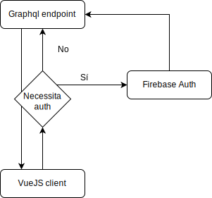

# Introducció

## Context

No cal recordar que el context actual de pandèmia mundial propícia que cada vegada més les persones romanguen a sa casa i realitzen totes les seues gestions de manera telemàtica, posant de relleu la importància de les eines digitals i de telegestió com ara videoconferències, aprenentatge online, administració electrònica, teletreball, etc...

És en aquest context que sorgeix la necessitat de modernitzar la gestió de l'Associació de Mares i Pares d'Alumnes (AMPA).

Fent un estudi de mercat, en un primer moment es va plantejar la possibilitat d'elaborar un model _SaaS_[^sass]. En aquest cas l'aplicació podria contenir la gestió de diferents AMPA i cadascuna d'elles podria tindre el seu propi subdomini. Aquest és el model més freqüent al mercat per a quest tipus d'aplicacions web. Per exemple:

- Mi ampa: [https://miampa.com/](https://miampa.com/)
- playoff gestión de asociaciones: [https://playoffinformatica.com/gestion-de-asociaciones/](https://playoffinformatica.com/gestion-de-asociaciones/)
- AmpaSoft: [https://ampasoft.es/](https://ampasoft.es/)
- AmpaNet: [https://www.ampanet.es/](https://www.ampanet.es/)
- EduTeca: [https://edutecaservicios.es/software-especializado/](https://edutecaservicios.es/software-especializado/)
- GesAmpa: [https://gesampa.com/joomla/](https://gesampa.com/joomla/)

No obstant això, aquesta possibilitat es va descartar perquè la finalitat inicial no era muntar un negoci _SaaS_ si no desenvolupar internament una eina per a l'autogestió de la AMPA de la que forme part com a membre de la Junta, fent-la el més oberta i transparent possible per a que puga ser implementada a altres AMPA o associacions que no vulguen un model de subscripció si no un d'autogestionat.

[^sass]: De les segles en anglès _Software as a Service_.

## Justificació del Treball

La gestió de les Associacions de Mares i Pares d'Alumnes inclou bases de dades amb dades de pares, d'alumnes, de pagament de quotes, de serveis, etc... Aquesta tasca s'ha realitzat tradicionalment de manera offline (MS Excel, MS Access, formularis en paper,...) i amb poca o cap automatització. El canvi a una eina online facilitarà no només aquesta gestió si no que propiciarà la participació dels propis pares i mares en la gestió i actualització de les seues dades, així com en la sol·licitud de serveis que ofereix la seua AMPA de manera online, evitant l'ús de formularis en paper i minimitzant el contacte físic, aspecte aquest molt important en aquests temps de pandèmia mundial.

A més a més facilitarà la comunicació dels membres de la Junta de govern del AMPA amb els seus afiliats, ajudant a gestionar els continguts coma ara notícies, activitats, juntes, etc... axí com l'enviament de notificacions push.

# Descripció

S'ha decidit finalment aplicar un enfocament basat en el model d'aplicació web progressiva (PWA[^pwa]) en el _frontend_ en combinació amb una API GraphQL per al _backend_.

[^pwa]: De les segles en anglès _Progressive Web App_.

El model d'aplicació web progressiva està basat en estàndards web i no en cap _framework_ o empresa. Per a que una aplicació web siga considerada **PWA**, ha de complir una sèrie de requisits que podríem dividir en tres grans àrees [@richard_what_2020]:

- Capaç: Gràcies a les cada vegada més extenses API web, hi ha poques coses que una web app no siga capaç de realitzar avui en dia (xat en temps real, notificacions push, geolocalització, etc...).
- Confiable: una PWA s'ha de sentir ràpida, tant en la càrrega com en la interacció amb l'usuari. A més a més ha de permetre certa usabilitat amb una connexió a la xarxa dèbil o inexistent. Açò és possible gràcies als _service workers_.
- Instal·lable: una PWA s'executa en la seua pròpia finestra i ha de poder ser llançada des de l'escriptori de l'usuari.

Pel que fa a **GraphQL** és un llenguatge query per a APIs que proporciona de manera automàtica una documentació de les dades que poden ser extretes de la API, autocompletat de les _queries_ i a més a més permet obtenir només aquells camps que ens interessen des d'un únic _endpoint_.

El projecte constarà de les fases que detallarem a continuació.

## Investigació/Requeriments

Investigació de les característiques que haurà de tenir l'aplicació en base a les necessitats d'una AMPA, seguit de l'elaboració d'un document de requeriments que haurà de ser aprovat per part del client. Una vegada tancat aquest document iniciarem la següent fase.

## Disseny

Elaboració del disseny de l'aplicació. S'elaborarà un _wireframe_ de baixa fidelitat i/o un _mockup_ d'alta fidelitat del disseny final.

Una vegada aprovat el disseny final passarem a la fase de desenvolupament.

## Desenvolupament

### Backend

Instal·larem l'eina [Hasura](https://hasura.io/) (a un servidor VPS contractat pel client, o a un servei al núvol). Això ens facilitarà tindre en funcionament una base de dades postgreSQL i un servidor graphQL de manera ràpida.

Dissenyarem les taules i les relacions necessàries, segons el full de requeriments.

Configurarem el sistema d'autenticació amb [Firebase](https://firebase.google.com/) i el d'autorització amb _Hasura_.

Addicionalment posarem en marxa un petit servidor _NodeJS_ per gestionar transaccions amb dades sensibles com per exemple certes claus API que necessiten residir al costat del servidor, i els mecanismes per autoritzar a un administrador, així com d'altres com ara l'enviament de missatges per correu electrònic o de notificacions push.

### Frontend

Instal·larem localment el framework [Quasar](https://quasar.dev/), basat en VueJS.

Elaborarem les rutes necessàries per a la nostra app així com el sistema d'autenticació i autorització.

Adaptarem la nostra app per que complisca els requisits d'una PWA i ens assegurarem que hem acomplit tots els requeriments.

## Proves

Escriurem els tests unitaris que necessitem i farem les proves d'integració i funcionals que calguen.

## Llançament

Actualitzarem les DNS del domini del client per a que apunte a la versió de producció de l'aplicació.

# Objectius

## Objectiu principal

- La modernització en la gestió de les AMPA, integrant el catàleg d'eines i aplicacions de gestió obsoletes en una única aplicació centralitzada i allotjada a un servidor web.

## Objectius secundaris

- El plantejament de les necessitats de les AMPA que puguen ser assolides mitjançant una aplicació web i que plasmarem en forma de requeriments.
- Substituir les eines privatives que poguéssin estar usant en l'actualitat per una aplicació web de codi obert que puga ser usada i adaptada per totes les AMPA de manera lliure.
- Evitar l'ús de formularis en paper i minimitzar el contacte personal.
- Afavorir la immediatesa en les gestions i comunicacions amb l'AMPA.

# Continguts

WIP

# Metodologia

S'emprarà una metodologia de tipus _waterfall_ amb retroalimentació. Per tant es presentarà el document de requeriments al client per a que el valide, i una vegada fet procedirem a executar cadascuna de les tasques necessàries de manera seqüencial, tornant enrere a alguna d'elles si fos necessari per reajustar algun requeriment.

# Arquitectura de l'aplicació

WIP

L'aplicació segueix un model MVVM[^mvvm].

[^mvvm]: _Model View View-Model_

El diagrama de flux de la nostra aplicació seria el següent:

{#fig:diagramaFlux}

# Plataforma de desenvolupament

Necessitarem els següents recursos:

- Una base de dades postgreSQL gestionada per una API GraphQL, mitjançant el _framework Hasura_.
- Un servidor NodeJS,
- Un _frontend_ VueJS mitjançant el framework _Quasar_.
- Un servei d'autenticació mitjançant _Firebase_.
  
El desenvolupament tindrà lloc principalment en dues màquines amb Sistema Operatiu Linux, i el IDE _Visual Studio Code_.

El present treball està redactat en llenguatge _Markdown_ i convertit a PDF amb [Pandoc](https://pandoc.org/).

# Planificació del treball

PAC | Activitat | Inici | Fi
--- | --- | ---| ---
1 | **Plantejament del projecte** | 17/02/2021 | 02/03/2021
" | Document de requeriments | " | "
" | Context i Justificació | " | "
" | Descripció del projecte | " | "
" | Objectius | " | "
" | Metodologia| " | "
2 | **Desenvolupament i documentació I** | 03/03/2021 | 31/03/2021
" | Desenvolupament i docs Backend | " | "
" | Desenvolupament i docs Frontend | " | "
" | Continguts | " | "
" | Arquitectura de la app | " | "
2 | **Desenvolupament i documentació II** | 01/04/2021 | 09/05/2021
" | Desenvolupament i docs Backend | " | "
" | Desenvolupament i docs Frontend | " | "
" | MVP i primeres proves (vídeo) | " | "
" | Procés de treball | " | "
" | CI/CD | " | "
3 | **Desenvolupament i documentació III** | 10/05/2021 | 07/06/2021
" | Finalitzar Desenvolupament i docs | " | "
" | Finalitzar Memòria TFM | " | "
" | Elaborar presentació | " | "
" | Presentació en vídeo | " | "
" | Elaborar autoinforme d'avaluació | " | "
Table: Planificació del treball

# Procés de treball/desenvolupament

WIP

# CI/CD

WIP

# Bibliografia
