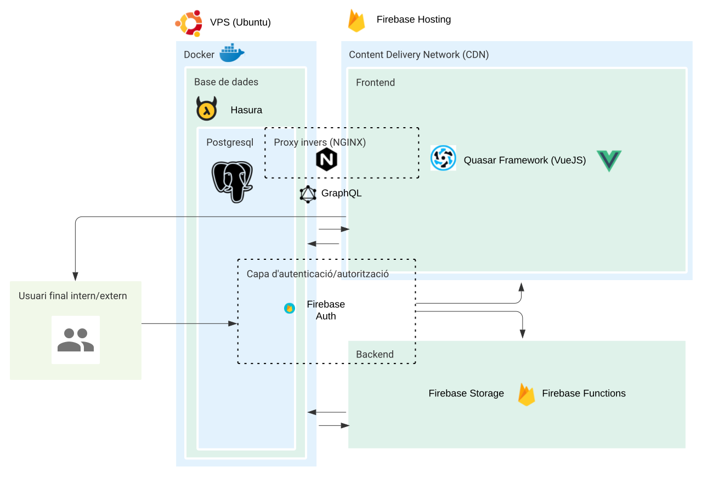
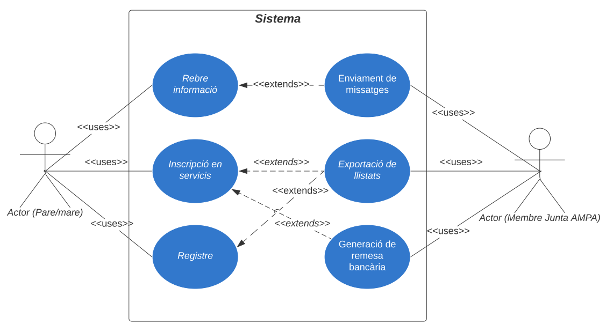
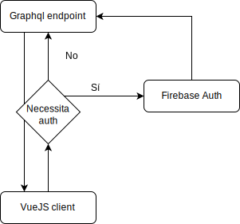
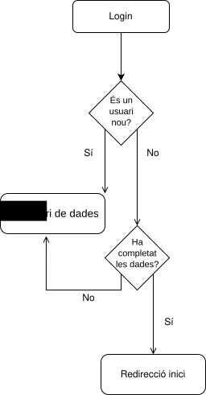
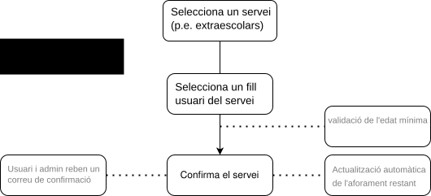
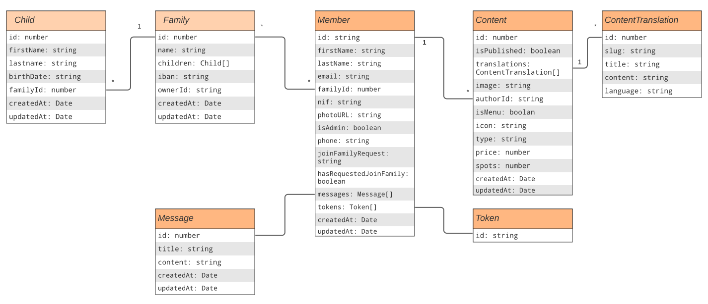
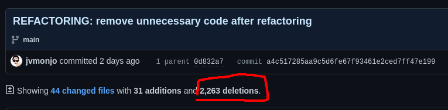

# Arquitectura de l'aplicació

L'aplicació segueix un model MVVM[^mvvm]. Es tracta d'un model de desenvolupament que separa el _business logic_ de la capa de presentació, el que propícia la separació i la modularització del nostre codi, afavorint l'elaboració de tests unitaris i col·laborant a tindre un codi més net i més fàcil de mantenir [@britz_enterprise_2017]. A diferència del model MVC[^mvc], el MVVM utilitza llenguatge de marcat per a la capa d'unió entre la capa lògica i la capa de presentació. Aquest és el cas del _framework VueJS_ tal i com podem veure a la @fig:mvvm. A més a més e el model MVC el controlador és el punt d'entrada de l'aplicació mentre que en el MVVM la vista és el punt d'entrada [@rungta_mvc_nodate].

[^mvvm]: _Model View View-Model_
[^mvc]: _Model View Controller_

{#fig:mvvm}

## Diagrames

A la @fig:diagramaArquitectura se'ns mostra un esquema de l'arquitectura de la nostra app.

En resum la nostra app consta de 3 parts fonamentals:

- La base de dades, allotjada a un VPS amb sistema operatiu Ubuntu, amb Docker i exposada a l'exterior amb un proxy invers (NGINX), mitjançant el framework Hasura, la qual cosa ens proporciona una base de dades PostgreSql i una API graphql.
- El _frontend_, desenvolupat amb Quasar Framework (VueJS) i allotjat al CDN de Firebase, cosa que disminueix el temps de latència en la resposta.
- Un _backend_ amb una arquitectura _serverless_ de Firebase Functions, que és bàsicament un servidor amb NodeJs on poder programar el nostre codi del costat del servidor. En aquest cas aquesta part de la infraestructura la usem per a l'enviament de missatges i tasques automatitzades com ara la creació del perfil per usuaris nous, l'atorgament de permisos d'usuari  i administrador, etc...

{#fig:diagramaArquitectura}

A la @fig:diagramaCasosUs figura el diagrama de casos d'ús de l'aplicació, posant èmfasi en els dos tipus d'actor, els pares/mares i els gestors de l'AMPA.

{#fig:diagramaCasosUs}

El diagrama de flux de les peticions de dades entre el client i la base de dades de la nostra aplicació el podem observar a la @fig:diagramaFlux.

{#fig:diagramaFlux}

A la @fig:diagLogin podem observar el flux quan fem login a l'aplicació. Hi ha que tindre en compte que la llibreria Firebase Ui usa la mateixa porta d'entrada per fer login que per fer sign up.

{#fig:diagLogin}

Un ús típic de l'aplicació serà la sol·licitud de serveis com ara les activitats extraescolars, tal i com es pot veure a la @fig:diagContracte.

{#fig:diagContracte}

A la @fig:diagClasses podeu observar el diagrama de classes en el que s'ha basat el disseny de la base de dades i dels models de TypeScript.

Aquest és el resultat d'una important refactorització. Podeu veure el diagrama anterior a la refactorització a l'annex 3.

{#fig:diagClasses}

## Repositoris

- Frontend i Backend: <https://github.com/fampa/ampa-pwa>
- Base de dades i GraphQL API: <https://github.com/fampa/ampa-graphql>

## URL de l'aplicació

<https://fampa-pwa.web.app/>

## Refactoring

Durant el desenvolupament de l'aplicació s'ha dut a terme una refactorització important tant de la base de dades com del _frontend_.

### Base de dades

#### Problema a resoldre

Molts dels camps d'algunes taules de la base de dades es repetien, portant a duplicitats i complexitat innecessàries.

#### Solució

A la base de dades s'ha aplicat la refactorització _Extract interface_ [^extract]. D'aquesta manera s'han pogut eliminar les taules Articles, Pages, Services, Tags i els corresponents Articles_translations, Pages_translations, Services_translations, Tags_translations, en favor de només dues taules: Contents i Contents_translations

[^extract]: <https://refactoring.guru/extract-interface>

### Frontend

#### Problema a resoldre

Havíem detectat un _code smell_[^smell] que consistia a una repetició de codi en diferents components encarregats de renderitzar diferents tipus de contingut.

[^smell]: <https://refactoring.guru/refactoring/smells>

Gràcies a la refactorització de la base de dades hem pogut refactoritzar també el codi al _frontend_.

#### Solució

També hem aplicat el _Extract method_ en aquest cas. Això ens ha permès eliminar els components específics que renderitzaven cadascún dels tipus de continguts per a passar a usar un únic component capaç de renderitzar tots ells.

El _commit_ on hem dut a terme aquesta refactorització ha propiciat 2.263 eliminacions.

