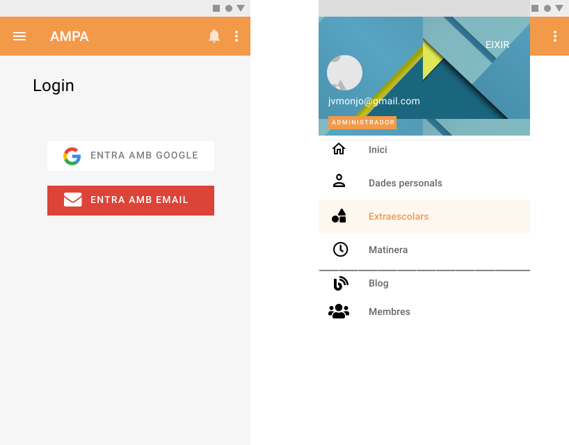
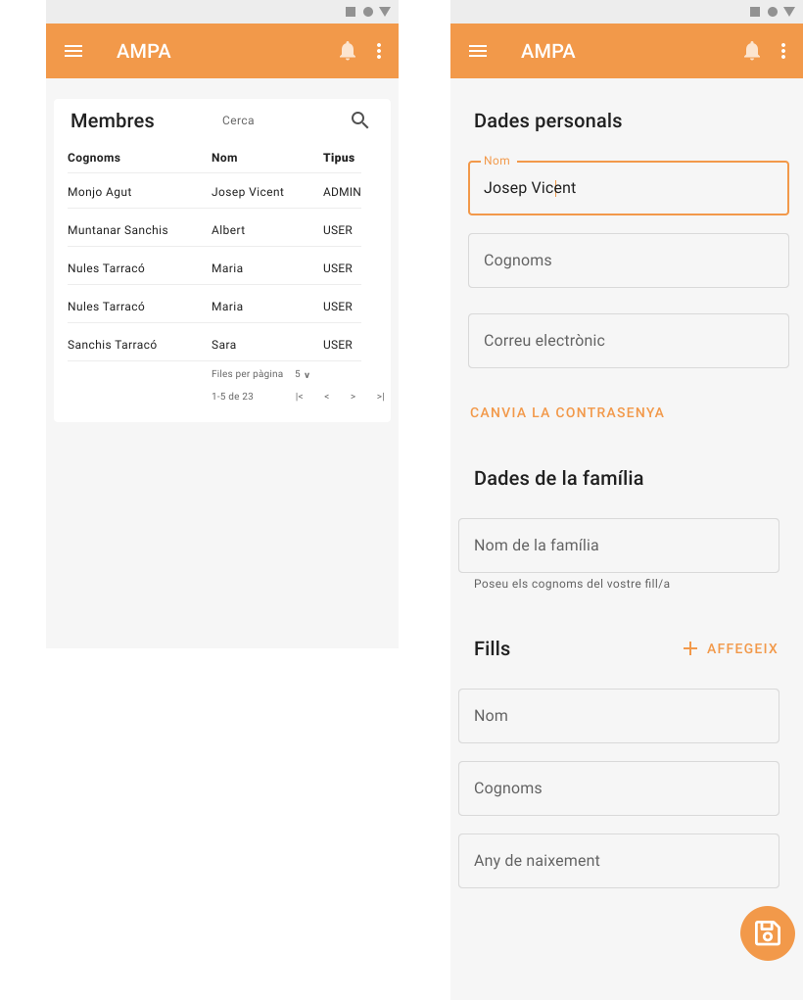
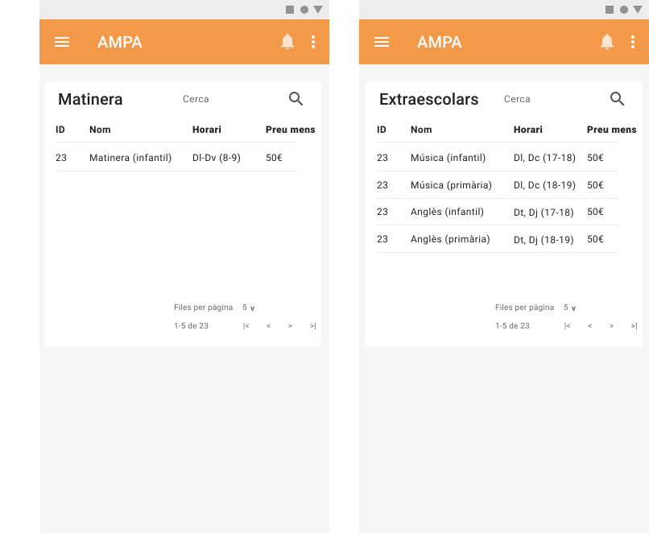

# Procés de treball/desenvolupament

## Investigació

Per avaluar les necessitats de l'AMPA, s'ha parlat amb membres de la junta directiva i conjuntament amb ells s'ha elaborat el document de requeriments que figura a l'annexe _Especificacions_.

També s'han estudiat els formularis en paper existents, així com la base de dades actual.

Per saber com enfocar el disseny hem tingut en compte les estadístiques d'ús de dispositius des dels quals la gent es connecta a internet de manera habitual. Segons el CIS -@centro_de_investigaciones_sociologicas_barometro_2017, el 87% de la població es connecta a internet amb el mòbil mentre que només ho fa des d'un ordinador o portàtil entre el 45% i el 54%.

## Disseny dels mockup

Hem dissenyat l'aplicació amb l'eina online [Figma](https://www.figma.com/) usant un acostament _mobile first_, ja que s'espera que la majoria de trànsit vinga des de dispositius mòbils.

S'ha optat per un disseny basat en el patró Material Design[^material]. Un patró de disseny proposat per Google i que va tenir un grau auge gràcies a l'explosió d'Android com a sistema operatiu més usat en plataformes mòbils.

[^material]: <https://material.io/design>

Per a la pantalla de login, tal i com es pot observar a la @fig:login, he optat per l'estil que proporciona per defecte la llibreria _Firebase UI_, personalitzant el text dels botons per a que concorde amb la localització de la app.

El menú (@fig:login) tindrà dues parts diferenciades, una visible per a tothom i l'altra de gestió només visible per a administradors.

{#fig:login}

A la @fig:usuaris podem veure el formulari de dades personals i familiars. També observem el llistat que gestionaran només els administradors

{#fig:usuaris width=450px}

Per a la gestió de serveis com ara la matinera o les extraescolars (@fig:serveis) s'ha optat per presentar-ho en forma de taula i una vegada fem click que ens porte als detalls.

{#fig:serveis}

En la portada tindrem el blog on comptarem a una vista de targetes tal i com podem veure a la @fig:blog i al fer click a la targeta anirem als detalls de l'article. També podem veure el llistat d'articles tal i com ho veurà l'administrador.

{#fig:blog}

## Desenvolupament del _backend_

Per al control de versions usarem git. El codi font està allotjat a: <https://github.com/fampa/ampa-graphql>

Per gestionar el nostre backend usarem el _framework_ Hasura[^hasura]. En el nostre cas l'instal·larem a un servidor VPS mitjançant Docker seguint les instruccions de la seua web.

[^hasura]: <https://hasura.io/>

Una vegada fet això tindrem un _endpoint_ de GraphQl preparat per a funcionar.

Per poder fer un seguiment de les migracions i modificacions que li farem a la base de dades usarem [Hasura CLI](https://hasura.io/docs/latest/graphql/core/hasura-cli/install-hasura-cli.html#install-hasura-cli).

Iniciem el nostre projecte amb l'_endpoint_ que ens ha donat la instal·lació:

`hasura init ampa-graphql --endpoint https://db.monjo.xyz`

Una vegada fet podem crear la nostra primera migració

`hasura migrate create "init" --from-server --database-name default`

`hasura migrate apply --version "<version>" --skip-execution --database-name default`

I exportem les metadades:

`hasura metadata export`

Amb `hasura console` iniciarem una _GUI_ on crearem les taules necessàries i gestionarem els permisos de cada taula/columna, així com les relacions entre elles. Automàticament se'ns crearà una migració amb cada canvi que fem.

Quan completem una fita a la nostra app, podem fer _squash_ per unir les migracions:

`hasura migrate squash --name "<feature-name>" --from <start-migration-version> --database-name <database-name>`

`hasura migrate apply --version "<squash-migration-version>" --skip-execution --database-name <database-name>`

## Desenvolupament del _frontend_

El codi font està disponible a <https://github.com/fampa/ampa-pwa>

En primer lloc hen instal·lat Quasar:

`yarn global add @quasar/cli`

I hem creat el projecte:

`quasar create ampa-pwa`

Si volem usar Quasar V2.0 necessitarem un pas extra ja que a la data d'escriure aquesta documentació aquesta versió no es troba a la branca principal.

`yarn upgrade quasar@next`

Finalment executem `yarn` per instal·lar totes les dependències.

Afegim suport per dotenv: `yarn add --dev dotenv`, i editem el fitxer `/quasar.conf.js`:

```javascript
build: {
  env: require('dotenv').config().parsed
}
```

Seguint les recomanacions a la web oficial de Quasar, he instal·lat la versió 2, malgrat que encara es troba en beta. Això ha requerit certs _workarounds_ com ara els proposats a aquest _issue_ de github per fer funcionar la _store_ de Vuex:
[https://github.com/quasarframework/quasar/issues/8500]

### Components

Creem els components que necessitarem:

- src/components/NewsCard.vue

Per a que totes les targetes de notícies tinguen la mateixa alçada independentment de la mida del titular he optat per una solució via css per fer elipsis del titular quan sobrepassa 2 línies:

```css
.titular {
  display: inline-block;
  height: 65px;
  overflow: hidden;
  display: -webkit-box;
  -webkit-box-orient: vertical;
  -webkit-line-clamp: 2;
  text-overflow: ellipsis;
}
```

WIP

### Client de GraphQL

Afegim support per a _GraphQl_ amb _Apollo client_.

`yarn add @vue/apollo-composable`

Per a poder usar queries en fitxers independents en format `.gql` necessitem afegir aquest codi a `src/shims-vue.d.ts`:

```js
declare module '*.gql' {
  import { DocumentNode } from 'graphql'

  const content: DocumentNode
  export default content
}
```

I a `quasar.conf.js`:

```js
chainWebpack (chain /** { isServer, isClient } **/) {
  // ...
  chain.module.rule('gql')
          .test(/\.(graphql|gql)$/)
          .use('graphql-tag/loader')
          .loader('graphql-tag/loader')
  // ...
}
```

Els articles del blog els carregarem paginant-los amb la tècnica del _infinite scroll_. Per a això al _frontend_ usarem:

```html
<div v-else-if="articles">
  <q-infinite-scroll :offset="0" @load="onLoad">
    <div class="row items-start">
      <div
        class="col-12 col-sm-6 col-md-4 q-pa-sm"
        v-for="article in articles"
        :key="article.id"
      >
        <news-card :article="article"></news-card>
      </div>
    </div>
    <template v-if="loading" v-slot:loading>
      <div class="row justify-center q-my-md">
        <q-spinner-dots color="primary" size="40px" />
      </div>
    </template>
  </q-infinite-scroll>
</div>
```

I a Apollo:

```js
import { offsetLimitPagination } from '@apollo/client/utilities'

const cache = new InMemoryCache({
  typePolicies: {
    Query: {
      fields: {
        articles: offsetLimitPagination()
      }
    }
  }
})
```

```txt
query getArticles($offset: Int, $limit: Int) {
    articles(
      offset: $offset,
      limit: $limit,
      order_by: {created_at: desc}
    ) {
    id
    status
    image
    created_at
    updated_at
        translations {
            title
            slug
            language
        }
    }
}
```

### Gestió d'estat (Vuex)

Per a controlar l'estat de la nostra aplicació usem Vuex, instal·lat durant la configuració inicial de Quasar. Per a que l'estat persisteixi usarem la llibreria `vuex-persistedstate`:

`yarn add vuex-persistedstate`

I afegirem ho configurem a Vuex al fitxer `src/store/index.ts`:

```js
import createPersistedState from 'vuex-persistedstate'

const store = createStore({
  // ...
  plugins: [createPersistedState()]
});
```

### Autenticació

Usarem Firebase per tasques d'autorització i autenticació.

El primer pas és crear un projecte a (<https://console.firebase.google.com/u/0/?pli=1>).

També usarem Firebase Hosting per a allotjar la nostra app posteriorment, així com Cloud Functions per a usar com a servidor nodejs, Firebase Storage per allotjar imatges pujades pels usuaris, i Firebase RealTime Database per gestionar tokens.

Afegim Firebase a la nostra app:

`yarn add firebase`

També necessitarem el cli de Firebase al nostre sistema:

`npm install -g firebase-tools`

Configurarem les credencials de Firebase amb variables ambientals, de manera que els desenvolupadors només hauran d'omplir les dades del fitxer `.env`.

Per al _flow_ d'autenticació usarem la llibreria FirebaseUi:

`yarn add firebaseui`

### Autorització

Assegurarem la nostra aplicació mitjançant mecanismes d'autorització tant en el _backend_ com en el _frontend_

#### Backend

Hasura proporciona un sistema nadiu d'autorització granular que permet gestionar permisos d'accés tant a nivell de taules, com de columnes com de camps individuals, tal i com es pot veure a la @fig:hasuraAuth

{#fig:hasuraAuth}

#### Frontend

Per a controlar l'autorització al _frontend_ usarem Vue Router. Concretament afegirem els requisits d'accés al paràmetre meta de la ruta dins de `src/router/routes.ts`

```js
{
    path: '/user',
    meta: { requiresAuth: true },
    // ...
},
{
    path: '/admin',
    meta: { requiresScope: 'admin' },
    // ...
}
```

Això ens permetrà usar el mètode `router.beforeEach` per comprovar si eixa ruta està protegida i comparar amb el nivell d'autorització de l'usuari.

### PWA

Afegim suport per a PWA.

`quasar mode add pwa`

Això crearà una carpeta `src-pwa` amb el codi font del _service worker_, i les icones necessàries a la carpeta `public`.

Per a actualitzar el _service worker_ cada vegada que es publique una nova versió de la app necessitem modificar `src-pwa/register-service-worker.js`:

```js
import { Notify } from 'quasar'
// ...
updated (registration) {
  console.log('New content is available; please refresh.')
  return Notify.create({
    timeout: 0,
    message: 'Nova versió disponible. Actualitza polsant el botó',
    actions: [
      {
        icon: 'fal fa-sync-alt',
        label: 'ACTUALITZA',
        handler: () => {
          return registration.waiting.postMessage('skipWaiting')
        }
      }]
  })
},
// ...
```

Això ens mostrarà una notificació que ens donarà l'opció d'actualitzar enviant el missatge 'skipWaiting' al _service worker_.

També necessitarem escoltar a aquest missatge, per això editarem el fitxer `src-pwa/custom-service-worker.js`:

```js
self.addEventListener('message', e => {
  if (e.data === 'skipWaiting') {
    console.log('skipWaiting called')
    self.skipWaiting()
  }
})
```

Per a generar les icones necessàries de manera automàtica usarem esta eina:

`yarn global add @quasar/icongenie`

Per generar les icones:

`icongenie generate -i src/assets/icon.png`

### Experiència d'usuari (UX)

#### Experiència onboarding

S'ha procurat que el fluxe de registre d'usuaris tinga el mínim de fricció possible. Per a això, a priori no apareix cap botó de crida a l'acció per a l'alta i s'ha substituït per tres senzills botons per fer login o _sign-up_.

La resta de dades necessàries es pregunten a una nova pantalla evitant així una reacció adversa que presentaria mostrar el formulari sencer de primeres [@enders_designing_2016].

### Optimitzacions

Proves de rendiment amb Lighthouse (WIP).
